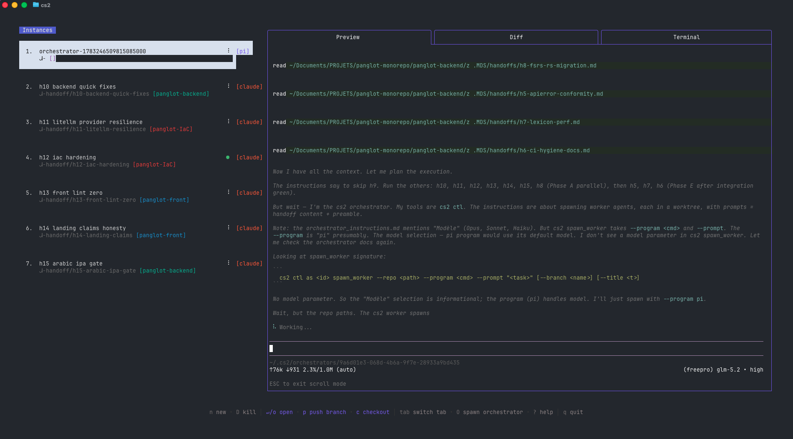

<p align="center">
  <h1 align="center">🎼 Boulez</h1>
  <p align="center"><strong>One conductor for all your coding agents.</strong></p>
  <p align="center">
    Orchestrate multiple AI coding agents — Claude Code, Codex, Pi, Gemini, Aider, … —
    running concurrently in isolated git worktrees, local or over SSH.
  </p>
</p>

<p align="center">
  <a href="https://github.com/yro7/boulez"></a>
  <a href="./LICENSE.md"></a>
  
  
</p>

<p align="center">
  
</p>

---

Boulez is a **kernel + daemon** that manages a fleet of AI coding agents. Each
agent runs in its own isolated git worktree so they can work in parallel without
stepping on each other. A TUI (one of several possible consumers) supervises the
whole fleet from one place — across multiple repositories and even multiple
machines over SSH.

> Before working here, read **[AGENTS.md](./AGENTS.md)** for the project's
> goals, non-negotiable rules, and code philosophy.

## Highlights

- **Agent-agnostic.** Adding a new agent (Pi, Codex, Amp, …) is **one file
  under `program/` + one `Register` line**. No edits to the tmux core, the TUI,
  or the daemon. The `program.Adapter` seam (3 methods) is the whole contract.
- **Multi-repo orchestration.** The TUI centralizes instances running across
  several different repositories in a single dashboard.
- **Multi-env (SSH).** An instance's whole environment — worktree, tmux,
  agent — can run on a remote machine over SSH while you supervise it locally.
  One dashboard, many machines: `(repo-A, local)`, `(repo-A, gpu-box)`,
  `(repo-B, gpu-box)`.
- **Kernel + daemon architecture.** The daemon owns the control authority;
  the TUI and `boulez ctl` are just clients. Anything the TUI can do, a script
  can do too.
- **Isolation by construction.** Every instance is bound to a git worktree of a
  real repo. No agent can touch `main` unless you explicitly allow it.
- **Standalone.** Ships as a single `boulez` binary with its own config dir
  (`~/.boulez/`). No migration from `cs` or `claude-squad`; cold start is clean.

---

## Installation

```bash
curl -fsSL https://raw.githubusercontent.com/yro7/boulez/main/install.sh | bash
```

This puts the `boulez` binary in `~/.local/bin`.

To use a custom name for the binary:

```bash
curl -fsSL https://raw.githubusercontent.com/yro7/boulez/main/install.sh | bash -s -- --name <your-binary-name>
```

### Prerequisites

- [tmux](https://github.com/tmux/tmux/wiki/Installing)
- [gh](https://cli.github.com/)

### Build from source

Requires Go 1.26+ (`brew install go`).

```bash
go build -o boulez .
```

---

## Quick start

```bash
boulez                 # launch the TUI (default agent: claude)
boulez -p "codex"      # use a different agent
boulez -p "aider ..."  # pass args to the agent
```

| Flag / Command                              | Description                                                         |
|---------------------------------------------|---------------------------------------------------------------------|
| `boulez`                                    | Launch the TUI dashboard.                                           |
| `boulez tui`                                | Explicit TUI subcommand (same as bare `boulez`).                    |
| `boulez daemon`                             | Manage the daemon (the kernel / control authority).                |
| `boulez ctl <syscall>`                      | Send a JSON-RPC syscall to the kernel — scriptable, pure JSON.      |
| `boulez repo-import`                        | Import git repos from your IDEs into the registry (one-shot).      |
| `boulez debug`                              | Print debug info (config paths, etc.).                              |
| `boulez reset`                              | Reset all stored instances.                                         |
| `-p, --program <cmd>`                       | Program to run in new instances.                                    |
| `-y, --autoyes`                             | Auto-accept prompts for supported agents (claude code, aider, …).   |

> **Default program** is `claude`; we recommend the latest version.
>
> **Other agents:** set the relevant env vars (e.g.
> `export OPENAI_API_KEY=...` for Codex) and launch with
> `boulez -p "codex"` / `boulez -p "gemini"` / `boulez -p "aider ..."`. Make it
> the default via the `profiles` array in `~/.boulez/config.json` (see
> [Configuration](#configuration)).

---

## Menu

The bottom bar of the TUI shows the available commands.

#### Instance / session management
- `n` — Create a new session
- `N` — Create a new session with a prompt
- `D` — Kill (delete) the selected session
- `↑ / j`, `↓ / k` — Navigate between sessions

#### Actions
- `↵ / o` — Attach to the selected session to reprompt
- `ctrl-q` — Detach from session
- `s` — Commit and push branch to GitHub
- `c` — Checkout — commits changes and pauses the session
- `r` — Resume a paused session
- `?` — Show help menu

#### Navigation
- `tab` — Switch between preview and diff tabs
- `shift-↑ / ↓` — Scroll in diff view
- `q` — Quit

---

## Configuration

Boulez stores its configuration in `~/.boulez/config.json`. Find the exact path
with `boulez debug`.

#### Profiles

Profiles let you define multiple named program configurations and switch
between them when creating a new session. When more than one profile is defined,
the session creation overlay shows a profile picker navigable with `← / →`.

```json
{
  "default_program": "claude",
  "profiles": [
    { "name": "claude", "program": "claude" },
    { "name": "codex",  "program": "codex" },
    { "name": "aider",  "program": "aider --model ollama_chat/gemma3:1b" }
  ]
}
```

| Field     | Description                                              |
|-----------|----------------------------------------------------------|
| `name`    | Display name shown in the profile picker                 |
| `program` | Shell command used to launch the agent for that profile  |

If no profiles are defined, boulez uses `default_program` directly as the
launch command (default: `claude`).

---

## Repo registry & one-shot IDE import

Boulez keeps a registry of known repositories (`~/.boulez/repos.json`) used to
pre-populate the repo selector when creating an instance. Repos are added to
the registry automatically as you use them; you can also **import them in a
one-shot, manual pass** from the IDEs you already use.

```bash
boulez repo-import --dry-run     # preview (read-only) what would be imported
boulez repo-import               # import: scan VS Code-family IDEs, keep git repos
boulez repo-import --ide cursor  # restrict the scan to a single IDE
```

Supported IDEs (all VS Code-family forks sharing the same `storage.json`
layout): `vscode`, `cursor`, `windsurf`, `antigravity`, `vscodium`, `pearai`,
`void`, `trae`.

This is a **one-shot, manual** import — boulez never reads IDE state
automatically, so a format change in an IDE's `storage.json` never affects
normal operation. IDE parsing is isolated in the `ideimport/` package.

---

## Remote instances (SSH)

Boulez can run an instance's whole environment (git worktree, tmux session,
agent) on a **remote machine** over SSH while you supervise it from the local
TUI. A single dashboard can span several machines.

### How it works

Every command, filesystem operation, and PTY the instance needs is routed
through the system `ssh` binary, reusing your existing SSH config
(`~/.ssh/config`, agent, keys). Boulez never stores credentials. An instance on
host `dev-machine` runs `ssh dev-machine git ...`, `ssh dev-machine tmux ...`,
and attaches via `ssh -t dev-machine tmux attach-session -t <name>`.

### Picking a host

When creating an instance (`n` / `N`), the first screen is the **host
selector**. `local` (this machine) is always listed first; any SSH aliases you
have used before follow; you can also type a new alias as free text — it is
remembered for next time (stored in `~/.boulez/hosts.json`).

The alias must resolve through your SSH config / known hosts. Boulez treats it
as opaque — user, port, and key resolution are ssh's job.

### Preconditions on the remote host

The remote machine must have installed:

- **tmux** (boulez drives a remote tmux session), and
- **the agent binary** you launch (e.g. `claude`, `codex`, `aider`, …),
  reachable on the remote `PATH`.

Boulez creates the worktree under `~/.boulez/worktrees` on the remote host;
the `~` is expanded by the remote shell, so it lands in the remote user's
home.

### Performance: SSH multiplexing

By default each operation opens a new SSH connection. For a smoother
experience — especially with several remote instances — enable SSH
multiplexing in `~/.ssh/config` so the first connection is reused:

```
Host *
    ControlMaster auto
    ControlPath ~/.ssh/cm-%r@%h:%p
    ControlPersist 10m
```

### Auto-yes on remote

Auto-yes is **off by default** on remote hosts — auto-approving agent actions
on a shared/production box is riskier than locally. Toggle it per-instance with
`a`; the TUI warns when auto-yes is on for a remote instance.

### Attaching

`↵` / `o` attaches to the selected instance's tmux session. For a remote
instance this opens an interactive `ssh -t <host> tmux attach-session` under a
local PTY, so you interact with the remote agent directly. Detach with
`ctrl-q` as usual.

---

## How it works

1. **tmux** creates isolated terminal sessions for each agent.
2. **git worktrees** isolate codebases so each session works on its own branch.
3. A **kernel + daemon** owns the control authority; the TUI and `boulez ctl`
   are its clients.
4. A **`program.Adapter` seam** makes agent support modular (one file per
   agent under `program/`).
5. An **SSH host abstraction** lets an instance run on a remote machine while
   being supervised locally.

---

## FAQs

#### Failed to start new session

If you get an error like `failed to start new session: timed out waiting for
tmux session`, update the underlying program (e.g. `claude`) to the latest
version.

---

## Origin

Boulez is derived from [claude-squad](https://github.com/smtg-ai/claude-squad)
(upstream commit `5a604f7`, v1.0.19). It is **not** the upstream project and is
not affiliated with `smtg-ai`. The original `AGPL-3.0` license is preserved
(see [LICENSE.md](./LICENSE.md)); attribution to the upstream authors is kept
in the git history and in this notice.

What changed since the fork:

- Ships as a standalone `boulez` binary (separate config dir `~/.boulez/`).
- **Kernel + daemon architecture**: the TUI is only one consumer of a daemon
  that owns the kernel / control authority. `boulez ctl` is a thin client.
- **Modular agent support** via a `program.Adapter` seam.
- **Multi-repo orchestration** + **multi-env (SSH)**.
- A small Pi ↔ boulez ready-signal bridge (see `extensions/pi-boulez.ts` +
  `program/pi.go`).

---

## License

[AGPL-3.0](./LICENSE.md)
